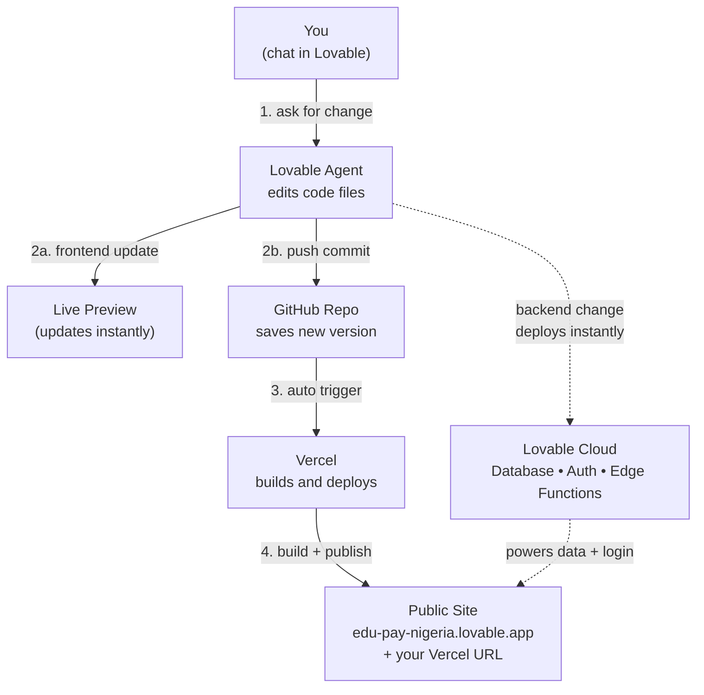

# How This App Works (Explain-Like-I'm-9 Edition)

Hi! This guide shows what happens behind the scenes when you ask Lovable to change something in this app. No tech words you don't need.

---

## The 3 places your app lives

| Place | What it does | Think of it as |
|---|---|---|
| **Lovable** | Where you chat. The agent writes code for you and shows a live preview. | The workshop |
| **GitHub** | Stores every version of the code, forever. | The save book |
| **Vercel** | Takes the code and shows it to the world at a public URL. | The shop window |

And one helper that sits behind everything:

| Helper | What it does |
|---|---|
| **Lovable Cloud** | The database, login system, and small server functions ("edge functions"). |

---

## What happens when you ask for a change

1. **You** type a request in the Lovable chat ("make the button blue").
2. **Lovable** edits the code files (like `src/pages/Auth.tsx`).
3. The **preview** at the top of the screen refreshes — you see it right away.
4. **GitHub** automatically gets a copy of the new code (two-way sync, no buttons to press).
5. **Vercel** notices GitHub changed, grabs the new code, builds it, and updates your **live site**.

Steps 4 and 5 happen on their own. The live site is usually updated in **1–2 minutes**.

---

## Frontend vs Backend — the important difference

- **Frontend** changes (buttons, colors, pages, text) → travel through **GitHub → Vercel** → live in 1–2 min.
- **Backend** changes (database tables, login rules, edge functions) → deploy to **Lovable Cloud immediately**. They do **not** go through Vercel.

So if the agent adds a database table, it's live in seconds. If the agent moves a button, it's live after Vercel finishes building.

---

## Flow diagram



ASCII fallback (in case Mermaid doesn't render):

```text
   You (chat)
       │ 1. ask for change
       ▼
   Lovable Agent ───────────► Live Preview (instant)
       │     │
       │     └──► Lovable Cloud   (backend deploys instantly)
       │ 2. push commit
       ▼
   GitHub Repo
       │ 3. auto trigger
       ▼
   Vercel  ── builds ──►  Public Site (live in ~1–2 min)
```

---

## What you should do as the boss

- **Just chat with Lovable.** You don't need to open GitHub or Vercel manually.
- **Wait ~2 minutes** after a publish before checking the live site. Vercel needs time to build.
- **Don't paste secrets** (passwords, API keys, bank details) into the chat. Ask the agent to use the secrets tool.
- **If a teammate edits the code on GitHub or their laptop**, the changes flow back into Lovable automatically.
- **Custom domain?** Connect it in Project Settings → Domains after the first publish.

---

## Quick troubleshooting

| What you see | What's probably happening | What to do |
|---|---|---|
| Live site still looks old | Vercel is still building | Wait 1–2 min and refresh |
| Refreshing a page shows 404 | SPA routing not set up | Already fixed via `vercel.json` rewrite |
| Login or data broken on live site | Lovable Cloud issue, not Vercel | Tell the agent — backend lives separately |
| "Sign up not allowed" error | Working as intended — public sign-up is off | Use admin dashboard to create users |
| GitHub shows changes but Vercel didn't deploy | Vercel project disconnected from repo | Reconnect in the Vercel dashboard |

---

## Where things live in this repo

- **Frontend pages**: `src/pages/`
- **UI components**: `src/components/`
- **Backend functions**: `supabase/functions/`
- **Database changes**: `supabase/migrations/`
- **Vercel config**: `vercel.json`
- **Environment variables**: `.env` (only `VITE_*` ones reach the browser)

That's the whole picture. Happy building!
