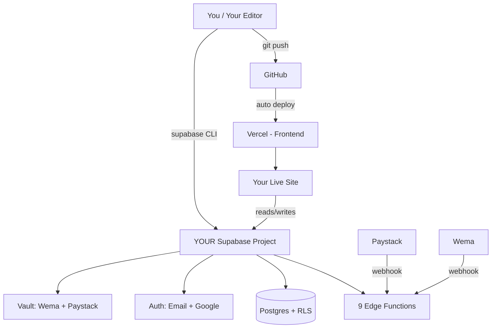

# 🏠 Own Your Backend — Moving Off Lovable Cloud

> A friendly, kid-simple guide to moving your app from **Lovable Cloud** to **your own Supabase project** — so you fully own and control everything.
>
> **Pair this guide with [`MIGRATION.md`](./MIGRATION.md)** — that file has the exact commands. This file explains the *why* and gives you a checklist.

---

## 🤔 Why move?

Right now your app's **backend** (database, login, edge functions, secrets) lives on **Lovable Cloud**. Lovable Cloud is Supabase under the hood — but the bill, the dashboard, and the keys are managed by Lovable.

After this migration:

| Thing | Before (today) | After (you own it) |
|---|---|---|
| Database | Lovable Cloud | Your Supabase account |
| Login / Auth | Lovable Cloud | Your Supabase account |
| Edge Functions | Lovable Cloud | Your Supabase account |
| Bills | Through Lovable | Directly from Supabase + Vercel |
| Frontend (the website) | Vercel ✅ | Vercel ✅ (unchanged) |
| Code | GitHub ✅ | GitHub ✅ (unchanged) |
| Lovable AI editor | Still works if you want it | Optional |

**You keep:** all your code, all your users (passwords too!), all your data, your domain, your design.
**You stop relying on:** Lovable for anything required to run the app.

---

## 🏘️ The 3 houses your app lives in (today vs. after)

### Today
```
GitHub  →  Vercel (frontend)  →  Lovable Cloud (backend)  ← Lovable owns this
```

### After migration
```
GitHub  →  Vercel (frontend)  →  Your Supabase (backend)  ← YOU own this
```

That's it. One swap. Frontend stays put.

See the diagram: **[`Own_Your_Backend.mmd`](/mnt/documents/Own_Your_Backend.mmd)** (open in any Mermaid viewer like https://mermaid.live).

---

## 🧰 What you need before starting

- ✅ A **GitHub** account (you already have this)
- ✅ A **Vercel** account (you already have this)
- 🆕 A **Supabase** account → https://supabase.com (free to sign up)
- 🆕 Some tools on your computer:
  - Node.js 20+
  - Supabase CLI: `npm install -g supabase`
  - Postgres tools (`pg_dump`, `psql`)
- 🆕 Your **Paystack** + **Wema** dashboard access (to repoint webhooks)
- ⏱️ **Time:** ~2–3 working days, spread over 1 calendar week (includes a 48-hour safety window)

---

## ✅ The 7-Phase Checklist

Each phase links to the exact commands in [`MIGRATION.md`](./MIGRATION.md).

### Phase 0 — Get ready (~2 hours)
- [ ] Push your Lovable project to GitHub (Plus ➕ → GitHub → Connect)
- [ ] Clone it to your computer: `git clone …`
- [ ] Run it locally to make sure it works: `npm install && npm run dev`
- [ ] Take a **backup** of the current Lovable Cloud database (script `01_export_schema.sh` + `02_export_data.sh`)

### Phase 1 — Create your own Supabase project (~1 hour)
- [ ] Go to https://supabase.com → **New Project**
- [ ] Region: **eu-west-2 (London)** — best for Nigeria
- [ ] Save the project ref, anon key, service-role key, and DB password in a password manager
- [ ] On your computer: `supabase login` then `supabase link --project-ref <YOUR_NEW_REF>`

### Phase 2 — Copy the database structure (~2 hours)
- [ ] Edit `supabase/config.toml` → change `project_id` to your new ref
- [ ] Run `supabase db push` — this re-creates all 14 tables, 18 functions, and RLS policies
- [ ] Verify: should see 14 tables when you list them

### Phase 3 — Copy the data (~1–4 hours)
- [ ] Run `03_restore_to_new.sh` — this copies users (passwords intact!), wallets, transactions, everything
- [ ] Re-sync the counters (transaction numbers, admission numbers) — script does this
- [ ] Compare row counts — old vs new must match exactly

### Phase 4 — Deploy the edge functions & secrets (~2 hours)
- [ ] Run `04_deploy_functions.sh` — deploys all 9 edge functions
- [ ] Fill in `.env.secrets` with your Wema keys, then run `05_set_secrets.sh`
- [ ] In Supabase Dashboard → **Authentication**:
  - [ ] Set Site URL to your domain
  - [ ] Add redirect URLs (localhost, vercel.app, custom domain)
  - [ ] Enable **Google** provider (paste OAuth client ID/secret)
  - [ ] Update Google Cloud Console redirect to your new Supabase callback URL
  - [ ] Turn ON **"Password HIBP Check"** (blocks leaked passwords)
- [ ] Run `06_gen_types.sh <NEW_REF>` to refresh TypeScript types

### Phase 5 — Point Vercel at your new backend (~1 hour)
- [ ] In Vercel → Project → **Settings → Environment Variables**, update:
  - `VITE_SUPABASE_URL` → your new Supabase URL
  - `VITE_SUPABASE_PUBLISHABLE_KEY` → your new anon key
  - `VITE_SUPABASE_PROJECT_ID` → your new ref
- [ ] Click **Redeploy** in Vercel
- [ ] Visit your site → smoke-test login + dashboard

### Phase 6 — The day of the move: switch webhooks (~30 min) 🚦
**Pick a low-traffic window** (early morning, weekend).
- [ ] Paystack Dashboard → Webhook URL → `https://<NEW_REF>.supabase.co/functions/v1/paystack-webhook`
- [ ] Wema → Webhook URL → `https://<NEW_REF>.supabase.co/functions/v1/wema-webhook`
- [ ] Send a test webhook from each → confirm it lands in `webhook_events` table
- [ ] If Wema requires IP allowlisting, share your NAT proxy IP **before** flipping the switch

### Phase 7 — Watch & decommission (1 week)
- [ ] **48 hours:** keep both backends warm. Watch for any errors.
- [ ] **End-to-end test:** sign up a new user, create a student, run payment simulator, check reconciliation, check audit log
- [ ] **After 7 clean days:** Lovable → Connectors → Lovable Cloud → Disable
- [ ] 🎉 You now fully own your backend.

---

## 🚨 If something breaks (Rollback in 3 steps)

Within the 48-hour window, you can roll back instantly:

1. **Paystack + Wema** → change webhook URLs back to the old Lovable Cloud endpoints
2. **Vercel** → revert env vars to the old values → redeploy
3. **Done.** Lovable Cloud is untouched and ready.

No data loss. No user impact. This is why we keep both backends warm for 48h.

---

## 💡 Boss tips

- **Don't rush the cutover.** Do Phases 0–5 calmly. Only Phase 6 is time-sensitive.
- **Test with one user first.** Try signing in with one real account on the new backend before flipping webhooks.
- **Keep secrets safe.** Never commit `.env.secrets` or the service-role key to GitHub.
- **Lower DNS TTL 24h before** your custom domain cutover (to 300 seconds) so changes propagate fast.
- **Paystack auto-retries webhooks for 72h** — small gaps during cutover heal themselves.

---

## 🗺️ Diagram



---

## ❓ What stops working vs. keeps working

| Stops (and what to use instead) | Keeps working unchanged |
|---|---|
| Lovable AI editor → use Cursor / VS Code / Copilot | All React code, Tailwind, shadcn |
| Lovable Cloud Secrets UI → Supabase Vault | All RLS policies and DB triggers |
| Auto types.ts regen → run `06_gen_types.sh` | Paystack inline checkout |
| One-click Publish → `git push` (Vercel auto-deploys) | Wema webhook flow |
| Preview URLs → Vercel preview deployments | User passwords (bcrypt migrates intact) |

---

## 📚 Want every command?

Everything technical lives in **[`MIGRATION.md`](./MIGRATION.md)**:
- Exact `pg_dump` / `psql` commands
- All 7 helper scripts in `scripts/migration/`
- Risk register
- Post-migration security hardening list

**This file** = the friendly checklist.
**`MIGRATION.md`** = the technical runbook.
**`HOW_IT_WORKS.md`** = how the app works today.

You've got this. 🚀
